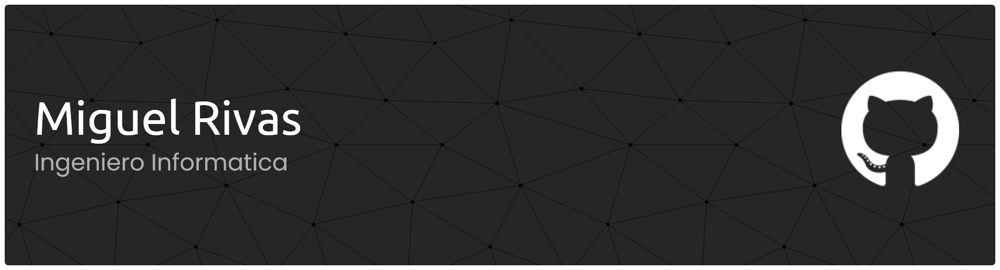

# 🔐 ¡Hola Mundo Cibernético! 👋 
### 🛡️ *Especialista en Ciberseguridad • Analista de Riesgos • Docente de Informática*

---

## 🌟 **¡Hola! Soy Miguel Rivas**

Soy un **especialista en ciberseguridad** apasionado por proteger el mundo digital 🛡️. Cuando no estoy analizando riesgos o enseñando seguridad informática, probablemente esté investigando nuevas vulnerabilidades o desarrollando herramientas para fortalecer sistemas.

### 🎯 **Mi Filosofía en Ciberseguridad**

| Principio | Descripción |
|-----------|-------------|
| 🔍 **Seguridad como Proceso** | No es un producto final, sino continuo |
| 🎯 **Prevención Proactiva** | Mejor prevenir que remediar |
| 🔄 **Aprendizaje Continuo** | Evolucionamos con las amenazas |
| 🛡️ **Educación como Defensa** | Capacitar es la mejor protección |

### ✨ **Lo Que Me Apasiona**

---

## 🎓 **Mi Journey en Ciberseguridad**

### 📜 **Certificaciones que Validan Mi Experiencia**

| 🏅 Certificación | 🎯 Especialización | 📅 Año |
|------------------|-------------------|--------|
| **Analista de Riesgos Cibernéticos** | Gestión y evaluación de riesgos | 2024 |

---

## 🛠️ **Mi Stack Tecnológico**

### 💻 **Lenguajes de Programación**

#### **Lenguajes de Sistemas**

#### **Lenguajes de Propósito Específico**

#### **Lenguajes Académicos y Funcionales**

### 🔧 **Especializaciones por Lenguaje**

**🖥️ Lenguajes de Sistemas**
- `C` - Programación de sistemas y bajo nivel
- `C++` - Desarrollo de alto rendimiento
- `Java` - Aplicaciones empresariales

**🐍 Lenguajes de Seguridad**
- `Python` - Automatización y análisis
- `JavaScript/TypeScript` - Seguridad web
- `Bash/PowerShell` - Scripting de sistemas

**🎓 Lenguajes Académicos**
- `Prolog` - Programación lógica e IA
- `Racket` - Programación funcional y DSLs

### 🛡️ **Herramientas de Ciberseguridad**

#### **Análisis y Pentesting**

#### **Plataformas de Seguridad**

#### **Entornos y Protección**

---

## 📞 **¡Conectemos!**

### 🌐 **Encuéntrame en Línea**

### 📬 **Información de Contacto Directo**

| Tipo | Contacto |
|------|----------|
| 🏢 **Email Corporativo** | [merivas@uca.edu.sv](mailto:merivas@uca.edu.sv) |
| 💼 **LinkedIn** | [Conectar](https://linkedin.com/in/tuperfil) |
| 🎯 **Disponibilidad** | Colaboraciones y consultorías |

---

## 🎯 **Vida Más Allá del Código**

### 🔍 **Actividades Profesionales**

**Mis intereses fuera del trabajo:**
- 📚 **Investigando** nuevos casos de ataques realizados en el país
- 🎯 **Participando** en CTFs (Capture The Flag)
- 🚀 **Asistiendo** a conferencias de ciberseguridad  
- 🔐 **Completando** certificaciones gratuitas de ciberseguridad

---

## 🔐 **¡Protejamos Juntos el Mundo Digital!** 🔐

*"La seguridad no es un producto, sino un proceso" - Bruce Schneier*

---

### ⚡ **¿Listo para Fortalecer Tu Seguridad?**
**¡Especializado en análisis de riesgos y protección de sistemas!**

